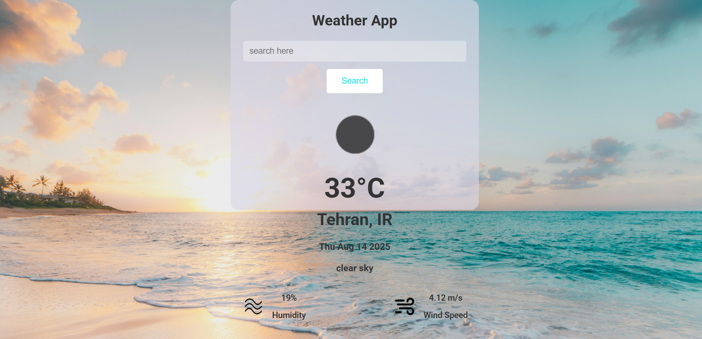

# Weather App – Simple Weather Forecast

Built as a personal JavaScript practice project, Weather App is a clean and responsive application that lets you search for any city and view the current weather conditions.

[Live Demo](https://weather-app-zakersoltani.netlify.app/)

---

## Screenshot



---

## Features

- **Search Weather** – Find weather information by entering a city name.
- **Current Weather Data** – Displays temperature, humidity, wind speed, and condition.
- **Dynamic Weather Icons** – Icons change automatically based on real-time conditions.
- **Responsive Design** – Works seamlessly on mobile, tablet, and desktop devices.
- **Error Handling** – Shows user-friendly messages for invalid or unknown city names.

---

## Built With

- **JavaScript (ES6+)**
- **HTML5 & CSS3**
- **Parcel** – Bundler for building and optimizing assets.
- **NPM** – For dependency management.
- **OpenWeather API** – For fetching live weather data.

---

## Getting Started

### 1️⃣ Prerequisites

Make sure you have the following installed on your machine:

- [Node.js](https://nodejs.org/)
- [npm](https://www.npmjs.com/)

### 2️⃣ Clone the Repository

```bash
git clone https://github.com/saharzakersoltani/weather-app.git
```

### 3️⃣ Navigate into the Project Folder

```bash
cd weather-app
```

### 4️⃣ Install Dependencies

```bash
npm install
```

### 5️⃣ Start the Development Server

```bash
npm start
```

---

## Contact

If you have any questions, feedback, or just want to connect, feel free to reach out:

- **GitHub:** [@saharzakersoltani](https://github.com/saharzakersoltani)
- **Email:** sahar.zs2002@gmail.com
- **LinkedIn:** [Sahar Zaker Soltani](https://www.linkedin.com/in/sahar-zaker-soltani)
